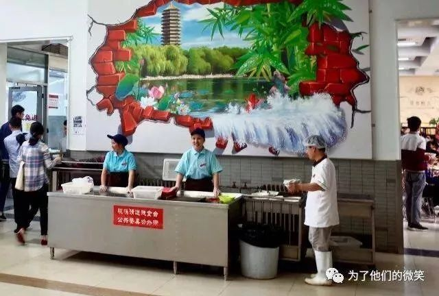
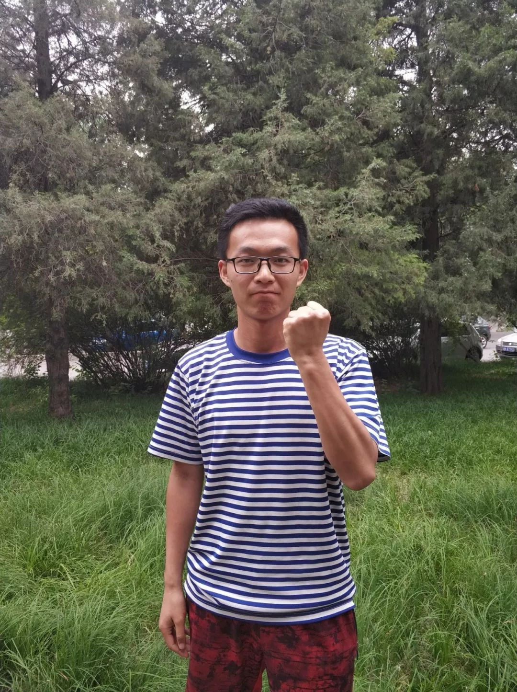

# 展振振：为了他们的微笑（原载于公众号“深约一丈”）

2018-05-11

5月1日，公众号“为了他们的微笑”发布了一篇推送——《五一|不应被遗忘的群体——2018年北大校园工人访谈全纪录》。和5月2日的刷屏握手与5月5日的校长道歉相比，这篇将近两万字的记录似乎并未引起多少波澜。
 
但是，一件事情的重要程度并不一定总是与舆论热度正相关。我们需要看到，这个社会中，总是有人在聚光灯前的暗处默默生活。**作为校工访谈的发起人，展振振希望用这种方式，让大家看到学校中的背影，看到这个不该遗忘的群体。**

展振振称，发起这次访谈，和他的个人经历有关。“我来自河南的一个农民工家庭，从小就对现在工人农民遭受的许多问题都有着比较切身的体会。”2015年进入学校之后，那篇发表于当年12月的后勤工人调研报告也给了他很多的启示。“原来即使在北大，我们的后勤工友同样处在比较恶劣的用工环境之中。”这吸引着他将目光投向了同学们熟视无睹的地方，那个不应被以往的群体。

“接触工人，会不会让人觉得你是一个‘异类’呢？”我不禁问他。“不会啊，**我看到他们，就像看到自己的母亲。” “我倒是比较奇怪，为什么这个占了校园将近十分之一的群体没有人去在意**。”

“农村出身的孩子，越来越难以考上好的大学。”去年夏天，北京状元熊轩昂的话还曾经火过一阵，虽然之后他选择去了更加“寂静”的隔壁。也许正是出身阶层的原因，北大学生越来越难以对体力劳动者产生共情。

而15年的报告，让刚入学的展振振发现，原来在学校中，确实有人在脚踏实地地关注着如自己父母一样的校园工人们，这篇报告，也给他留下了很深的感动与震撼。从15年到18年，两年多过去了，校园工人们的生活是否发生了改变？他希望用再一次的调研来解决这个疑问。

于是，2018年2月，展振振召集了五十多名来自各个院系不同专业的同学，组成了访谈小组。经过假期中十天的密集采访，总共访谈了303名校园工友，占总数的十分之一。在寒假期间进行汇总分析，撰写访谈记录，大家都耗费了很多精力。
 
在访谈过程中，小组成员也经历过不少挫折。由于吸取了上次调研报告的“教训”，某些用工单位领导对于学生进入宿舍这事颇为忌惮。学生们曾在宿舍中遭遇过粗鲁的驱赶，访谈对象也曾被宿舍管理员向上级打过小报告。“但我们还是觉得，这是件非常有意义的事情。”“和工友打交道不一样，**虽然最开始总会有一些障碍，但熟悉之后你会发现并折服于他们身上浓浓的坦率与朴实**。”
 
访谈中的很多经历没法体现在报告里，但让人印象深刻。在走访中，展振振认识了一位58岁的老人，在食堂后厨打杂。这位老人每天早上五点起床，晚上七点或十点下班，每天工作十二到十五小时。“这对我是一个非常大的冲击，”展振振说，“**我之前只知道中青年会吃苦，但没想到以为老人也在这样为了生活奔波受累，而且一个月才拿着三千多块的工资。”
 
“这就像一把刀一样，刻在我的心上。”
 
总有人会抱着这样的观点，认为既然这样的工作待遇不好，那么换一个工作不就好了，没人拦着你去受累。但经过走访的了解，展振振直言，“这其实是无奈”。像刚才那样已经58岁的老人，包括洗碗间的大哥大姐，在这样的年龄，他们其实很难再找到工作。为了生活，为了多补贴家庭，他们只能选择这样工作强度大，却薪水微博的职业。“**这不是他们自己的问题**。”他说。
 
在今天，“只扫自家门前雪”已经成为大多数的逻辑，关心弱势的人则往往会被一概而讽为“圣母”。对于这样的标签，展振振觉得不理解，但也不会在意。“我的家人，他们都在外面拼搏。我看到这些大哥大姐还有保安，他们和我的家人一样奔波劳累，辛苦又朴实。”圣母一词的内涵，往往概括了一种居高临下的关系。但展振振觉得，**这样做只是通过自己的方式，给对自己来说和家人一样的工友们做一些事情，“不是什么高贵神圣的事”**。但可能无奈之处就在于，主流舆论看来，一个北大学生比几千名后勤工人“更有价值”吧。
 
对于学生与工人的关系，展振振认为这不是矛盾的。饭菜里有异物、服务态度问题，这些矛盾确实会遇到。“但如果你了解他们的艰辛与不易，可能很难再对他们进行什么严苛的批判。”曾经参加过“你的名字”校园工人体验活动，展振振亲身了解过食堂的工作环境。“其实学校的后厨与外面比起来确实是干净很多的，许多工作上的疏忽确实是百密一疏。”他觉得，**如果能多一些这样的活动，让学生对身边的工人多一些了解，多一些沟通，“现实也许会很不一样”。**
 
偶尔出现的这些问题确实需要改正，但虽然问题的严重程度大小不一，罚款却从来不会考虑真正的问题。展振振称，据工友介绍，餐饮中心规定，只要BBS有投诉，就会罚款，从一两百到以前不等，“不管你有没有错”。“比如就餐高峰期，一个档口的餐巾纸准备不及时，同学在BBS上发了帖。同学的的希望其实是是好的，但结果往往是工友因此被罚掉一天的工资。”**曾有工友像他展示过一沓二三十张罚款单，每张单子上的数额相加起来，是她一年被罚款的数量，几近于整整一个月的工资。**
 
“工友没有申诉的权利，只能做被处罚的对象。”“食堂员工们会积极改正问题的，只是缺少学生和工友直接沟通的渠道。”因为投诉而被罚掉的工资，罚掉的也是一个家庭的收入来源，也许也是一个孩子上学的权利。
 
对于这篇报告，展振振“确实有过一些担心”。但他认为，**五一节的意义，不仅仅是三天假期；劳动的价值，需要通过切实的行动去得到彰显。**“这不是在给什么事情添乱”，这篇访谈记录，是小组同学的心血，是学生对工人脚踏实地的关怀，这是它相对于一些其他事情更有意义的地方。因此，他还是选择在五一当天将它公布。
 
关注，仅仅是一个开始。从关注转化为行动，正是建设之所在。展振振认为，这个涉及学生、工人、学校部门和私营单位四个主体的问题，需要在之后在推动中得到解决。后勤问题在国内高校普遍存在，而作为北大人，“应该要有直面问题、解决问题的勇气与决心”。
 
作为学生，首先能做的，就是对工人群体进行尊重。比如把垃圾整理好在丢弃，送餐盘时说一声谢谢。“**其实这些非常微小的举止，在工友们看来是非常温暖的。**”并不是所有的既存现实都是那么的理所应当，很多事情，都有它们应该有的样子。改变，总要从微小处开始。

“要不你换个姿势？现在大家都不喜欢举起拳头。”拍照时我问他说。

“**我觉着这姿势挺好**。”他又把手攥得更紧了一点。